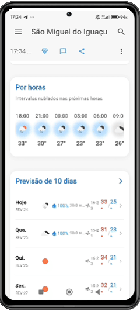
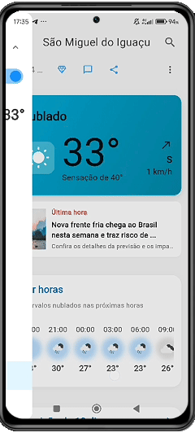
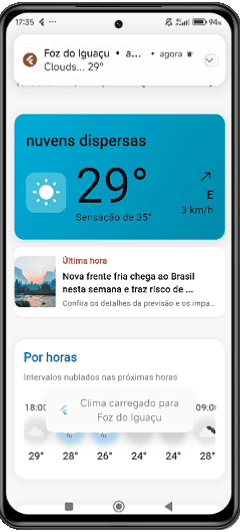

# ClimaLife - Aplicativo de Previsão do Tempo

Um aplicativo de previsão do tempo moderno baseado em Flutter que utiliza a API OpenWeatherMap para dados meteorológicos em tempo real, previsões e serviços baseados em localização.

##  Funcionalidades

- **Previsão do Tempo em Tempo Real:** Obtenha dados meteorológicos atuais e precisos para qualquer local.
- **Previsão de 7 Dias:** Planeje sua semana com a previsão detalhada para os próximos 7 dias.
- **Busca de Cidades:** Encontre a previsão do tempo para qualquer cidade do mundo.
- **Favoritos:** Salve suas cidades favoritas para acesso rápido.
- **Mapas Meteorológicos Interativos:** Visualize camadas de mapas para temperatura, chuva, vento e nuvens.
- **GPS Inteligente:** Detecta e gerencia o status do GPS para obter a localização do usuário.
- **Notificações:** Receba alertas meteorológicos importantes.
- **Tema Escuro e Claro:** Alterne entre os temas para uma melhor experiência de visualização.

## 📱 Demonstração do Aplicativo

Veja abaixo as principais funcionalidades e a interface do ClimaLife em ação:

| Dashboard & Tempo Real | Detalhes & Previsão |
| :---: | :---: |
|  |  |
| **Busca & Favoritos** | **Mapas Meteorológicos** |
|  |  |

---


##  Pré-requisitos

- Flutter SDK (^3.6.0)
- Dart SDK
- Android Studio / VS Code com as extensões do Flutter
- Android SDK / Xcode (para desenvolvimento iOS)
- **Chave de API do OpenWeatherMap** (gratuita)

## 🛠️ Instalação

### 1. Instalar dependências:
```bash
flutter pub get
```

### 2.  **IMPORTANTE: Configurar a Chave da API**

**O aplicativo não funcionará sem este passo!**

1. Obtenha uma chave gratuita em: [https://openweathermap.org/api](https://openweathermap.org/api)
2. Abra o arquivo `lib/core/constants/api_constants.dart` (ou o local onde sua chave está armazenada).
3. Substitua `'YOUR_API_KEY_HERE'` pela sua chave real.

### 3. Executar o aplicativo:
```bash
flutter run
```

##  APIs de Mapas Meteorológicos

O aplicativo utiliza APIs gratuitas para fornecer mapas meteorológicos interativos:

- **Windy.com:** Fornece camadas de temperatura, precipitação, nuvens e vento com cores vibrantes e dados em tempo real.
- **RainViewer:** Oferece um radar de chuva em tempo real, mostrando a intensidade da precipitação.

##  Funcionalidade de GPS

O menu lateral inclui um controle de GPS que permite:
- Verificar e exibir o status atual do GPS (ligado/desligado).
- Redirecionar o usuário para as configurações do sistema para ativar ou desativar o GPS.
- Exibir as coordenadas de latitude e longitude da localização atual.
- Gerenciar as permissões de localização do aplicativo.

##  Estrutura do Projeto

```
lib/
├── core/           # Utilitários, constantes e serviços principais
├── models/         # Modelos de dados (Weather, News, etc.)
├── presentation/   # Telas e widgets da interface do usuário (UI)
├── repositories/   # Repositórios para buscar e gerenciar dados
├── routes/         # Configuração de rotas de navegação
├── services/       # Serviços de API e outros
├── theme/          # Configuração de temas (claro e escuro)
└── widgets/        # Widgets reutilizáveis
```

##  Backend em Go

O backend vive em `backend/` e foi escrito em Go seguindo Clean Architecture e o layout padrão de projetos (`cmd/`, `internal/`, `pkg/`). Ele é responsável por orquestrar integrações externas (OpenWeatherMap), cache (Valkey/Redis) e persistência (PostgreSQL). Abaixo um resumo dos principais componentes:

- `cmd/server/main.go`: ponto de entrada. Carrega variáveis de ambiente (`internal/config`), abre conexões com PostgreSQL e Valkey, cria clientes externos (OpenWeatherMap), instancia repositórios/serviços e sobe o servidor HTTP com desligamento gracioso.
- `internal/api`: camada HTTP (handlers + roteador). Os endpoints implementados atualmente incluem:
  - `GET /weather?lat={lat}&lon={lon}` — retorna clima atual + previsões horárias/diárias usando cache Redis antes de ir ao OpenWeatherMap.
  - `POST /register` — cria usuários persistindo e hashando senha com bcrypt.
  - Rotas CRUD básicas para favoritos (`/favorites`), configurações de notificação (`/notifications/settings`) e assinatura (`/subscription`). Elas já estão conectadas aos serviços/repositórios, mas ainda usam um UUID fixo aguardando autenticação real.
  - `GET /maps/config` — expõe configurações do módulo de mapas para o app.
- `internal/core`: concentra domínio (`domain/*.go`) e serviços (`services/*.go`). Destaques:
  - `WeatherService` consulta o cache (`internal/platform/cache`) e, em caso de miss, chama `internal/platform/clients/openweathermap`, persiste o resultado em Redis por 30 minutos e devolve os dados estruturados em `domain.WeatherData`.
  - `UserService`, `FavoriteCityService`, `NotificationSettingsService` e `SubscriptionService` apenas delegam aos repositórios.
- `internal/platform`: infraestrutura compartilhada.
  - `clients/openweathermap`: cliente HTTP que combina `/weather` e `/forecast` da API pública, convertendo as respostas em estruturas do domínio (8 horários + 6 dias).
  - `cache/weather_cache.go`: abstração para Redis (Valkey) com serialização JSON.
  - `database/*.go`: repositórios com `pgxpool` para usuários, favoritos, notificações e assinaturas.
- `migrations/`: scripts SQL compatíveis com `golang-migrate`, aplicados automaticamente pelo `entrypoint.sh` quando o contêiner sobe.
- `docker-compose.yml`: sobe `backend`, `postgres` e `valkey` compartilhando a mesma network, ideal para desenvolvimento local. O Dockerfile usa build multi-stage e inclui a CLI do `migrate`.

Fluxo de requisição exemplo:
1. App Flutter chama `GET /weather`.
2. Handler valida `lat/lon`, invoca `WeatherService`.
3. Serviço tenta ler `weather:{lat}:{lon}` no Valkey; se não existir, chama o cliente da OpenWeatherMap.
4. Resultado é salvo no cache por 30 min e retornado ao app já no formato esperado pela UI.

##  Agradecimentos
- Construído com [Flutter](https://flutter.dev) & [Dart](https://dart.dev)
- Dados da API por [OpenWeatherMap](https://openweathermap.org)
- Mapas por [Windy.com](https://www.windy.com) e [RainViewer](https://www.rainviewer.com/)
- Ícones por [OpenWeatherMap](https://openweathermap.org/weather-conditions)